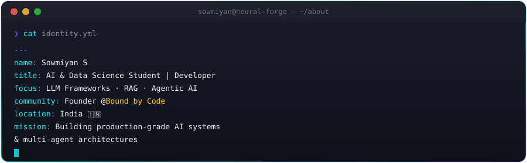

<!-- ═══════════════════════════════════════════════════════════════════════════ -->
<!--              🧠 SOWMIYAN S — AI & LLM SYSTEMS ENGINEER                  -->
<!--        Custom-designed GitHub profile with handcrafted SVG assets        -->
<!-- ═══════════════════════════════════════════════════════════════════════════ -->

<!-- HERO BANNER — Retro Stylized Aesthetic Animated SVG with Synthwave Sunset, Rolling Grid & Curly Typography -->

  

<!-- Profile Metrics Bar -->

  
  &nbsp;
  
  &nbsp;
  

<!-- Typing Animation -->

  

<!-- Animated Divider -->

  

<!-- ═══════════════════════════════════════════════════════════════════════════ -->
<!--                              ABOUT ME                                    -->
<!-- ═══════════════════════════════════════════════════════════════════════════ -->

  

<!-- Custom Animated Terminal SVG -->

  

<!-- Metrics Dashboard -->

  

<table>
<tr>
<td width="50%" valign="top">

**🧠 AI-First Builder**
> Designing intelligent pipelines with LangChain, CrewAI & NVIDIA NeMo — from prototype to production.

**🏗️ Scalable Systems**
> From monolith to microservices — architecting for scale with cloud-native patterns.

</td>
<td width="50%" valign="top">

**🌍 Community Leader**
> Mentoring next-gen engineers through **Bound by Code** — workshops, hackathons & premium content.

**📖 Continuous Learner**
> Exploring frontier AI, agentic loops, edge deployment & cutting-edge research.

</td>
</tr>
</table>

<!-- Animated Divider -->

  

<!-- ═══════════════════════════════════════════════════════════════════════════ -->
<!--                           TECHNOLOGY STACK                               -->
<!-- ═══════════════════════════════════════════════════════════════════════════ -->

  

 

<h4 align="center">🧠 AI / ML / Data Science</h4>

  

  
  
  
  
  

  
  
  
  

<h4 align="center">💻 Languages & Frameworks</h4>

  

<h4 align="center">🗄️ Databases, Cloud & DevOps</h4>

  

<h4 align="center">🛠️ Tools & Platforms</h4>

  
  
  
  
  

<!-- Animated Divider -->

  

<!-- ═══════════════════════════════════════════════════════════════════════════ -->
<!--                          GITHUB ANALYTICS                                -->
<!-- ═══════════════════════════════════════════════════════════════════════════ -->

  

<!-- Stats + Language Cards -->

  
  &nbsp;
  

<!-- Streak Stats -->

  

<!-- Profile Details Card -->

  

<!-- Activity Graph -->

  

<!-- Animated Divider -->

  

<!-- ═══════════════════════════════════════════════════════════════════════════ -->
<!--                        LEETCODE VISUALIZATION                            -->
<!-- ═══════════════════════════════════════════════════════════════════════════ -->

  

  

  

<!-- Animated Divider -->

  

<!-- ═══════════════════════════════════════════════════════════════════════════ -->
<!--                          FEATURED PROJECTS                               -->
<!-- ═══════════════════════════════════════════════════════════════════════════ -->

  

<!-- PROJECTS_START -->
<table>
<tr>
<td width="50%" valign="top">

<h3 align="center">🤖 <a href="https://github.com/sowmiyan-s/crewlyze">Crewlyze</a></h3>

<em>Autonomous Data Intelligence &amp; Multi-Agent Analytics</em>

> A modular data-analyst pipeline powered by LLM-driven multi-agent orchestration. Automates data ingestion, exploratory analysis, statistical insights, and executive chart generation.

  
  
  
  

</td>
<td width="50%" valign="top">

<h3 align="center">🛡️ <a href="https://github.com/sowmiyan-s/GUARD-RAG">GUARD-RAG</a></h3>

<em>Secure Offline-Capable RAG &amp; LLM Guardrails</em>

> Privacy-first, offline-capable Retrieval-Augmented Generation framework built as a Python package. Features semantic vector search, strict guardrails against hallucinations, and enterprise privacy safeguards.

  
  
  
  

</td>
</tr>
<tr>
<td width="50%" valign="top">

<h3 align="center">🌐 <a href="https://github.com/sowmiyan-s/We-Share">We-Share</a></h3>

<em>Collaborative Knowledge &amp; Resource Sharing Platform</em>

> Modern full-stack platform enabling peer-to-peer resource sharing, real-time collaboration, and community content discovery with lightning-fast cloud synchronization.

  
  
  
  

</td>
<td width="50%" valign="top">

<h3 align="center">🦺 <a href="https://github.com/sowmiyan-s/PPE-Detection-and-Management-System">PPE Detection &amp; Safety AI</a></h3>

<em>Real-Time Computer Vision Compliance System</em>

> Intelligent workplace safety system leveraging YOLOv8 computer vision and ByteTrack multi-object tracking paired with an interactive React management dashboard for automated compliance monitoring.

  
  
  
  

</td>
</tr>
</table>
<!-- PROJECTS_END -->

<!-- Animated Divider -->

  

<!-- ═══════════════════════════════════════════════════════════════════════════ -->
<!--                      BOUND BY CODE COMMUNITY                            -->
<!-- ═══════════════════════════════════════════════════════════════════════════ -->

  

> **Bound by Code** — Where creators and innovators collide.
> Bridging the gap between learning and building through hands-on AI/Web workshops, hackathons, and premium tech content.

 

&nbsp;

&nbsp;

&nbsp;

  

&nbsp;

&nbsp;

<!-- Animated Divider -->

  

<!-- ═══════════════════════════════════════════════════════════════════════════ -->
<!--                           GET IN TOUCH                                   -->
<!-- ═══════════════════════════════════════════════════════════════════════════ -->

  

  
  &nbsp;
  
  &nbsp;
  
  &nbsp;
  
  &nbsp;
  

 

<!-- ═══════════════════════════════════════════════════════════════════════════ -->
<!--                          CUSTOM SVG FOOTER                               -->
<!-- ═══════════════════════════════════════════════════════════════════════════ -->

  

